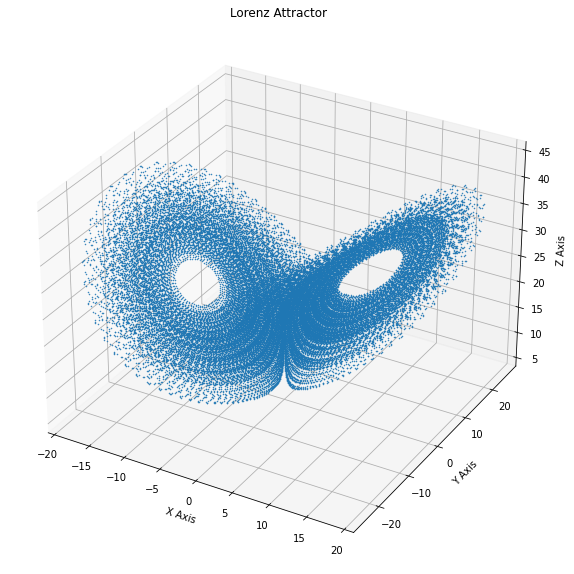
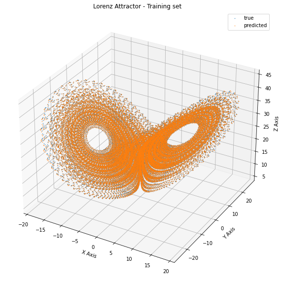
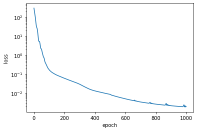
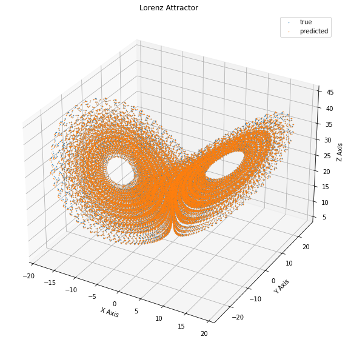
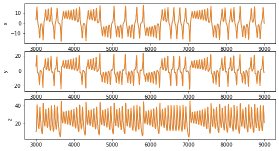
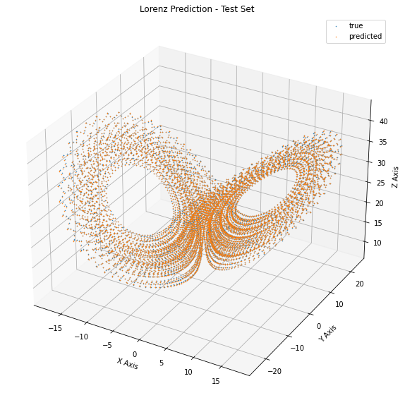
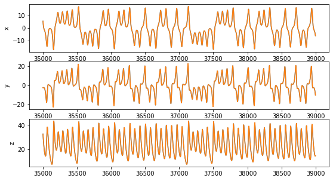
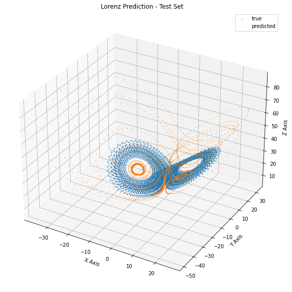
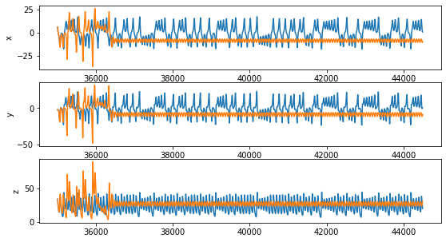
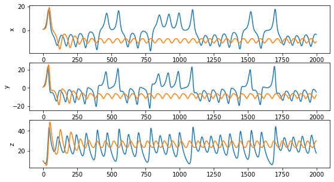

Before digging into some of the saucy details of dynamical systems theory, I think it is time to introduce at least a bit of machine learning in this blog. 
The chance came naturally yesterday, as I wanted to learn how to use [Jax](https://jax.readthedocs.io/en/latest/), which is a sort of improved numpy, with a "functional soul". 
I'm not digging into details about the codind part since I'm far for beeing confident with the library and this post will mainly revolve around the conceptual part of the topic. 
Yet, I will show all the code I used, so that you can follow through and appreciate the functionalities offered by Jax.
If you are not confident with it, you will maybe find some part of this blogpost a bit mysterious, but you should still be able to follow through. 

## Learning a dynamical system

In this post I will quickly expose what does it mean to _learn_ a dynamical system and what are the differences with respect to the more classical problems one is used to when dealing with machine learning. 
We are facing the following problem:

given a series of data which  ${x_0, x_1, \dots, x_t, \dots, x_T}$ we want to learn (i.e., estimate) the dynamical sytem generating them. This means assuming that our data were generated by an unknown process of the form:


\begin{equation}\label{eqn:discrete_system}
	x_{t+1} = G(x_t)
\end{equation}
 
and we want to extimate $G$. 
Usually when dealing with this kind of task, one first creates a model of the system (e.g.,  assume that it is linear) and then uses the data to fit its parameter (e.g., find the entries of the matrix). 
But this requires some knowledge of the system under consideration. 
What if we do not know anything about the rule governing our system? Can we still hope to do something?

Yes, luckily.  
We can actually do a lot using a model-agnostic data-driven approach.

## Generating the data

As an example we will use the [Lorenz system](https://verzep.github.io/Butterfly-Effect/) which we introduced last time, as it is one of the most studied one even for this kind of problems, since it is quite simple but displays all the main features the one would like to have.

So first of all we need to generate the data. 
The Lorenz System is described by a differential equation that reads:

\begin{aligned}
\frac{dx}{dt} &= \sigma (y - x) \\
\frac{dy}{dt} &= x (\rho - z) - y\\
\frac{dz}{dt} &= x y - \beta z. \\
\end{aligned}


but since we are not interested in the particular details of our system (we are not even supposed to know them!) we will simply refer to it as:

\begin{equation}\label{eqn:continuos_system}
\dot{x}(t) = g(x(t))
\end{equation}

where (with an abuse of notation) $x(t)$ will be our $3$-dimensional state, $\dot{x}(t)$ its time derivative and $g$ the function governing its evolution. 
Note that \eqref{eqn:discrete_system} is a cotinuous time system, describe by a differential equation and not a discrete system like the the one we are trying to learn. But, as described [in a previous post](https://verzep.github.io/Dynamical-Systems/), one has a discrete-time dynamical system _naturally_ associated to a continuos time one, which is given by the integration of its equation of motion. 
So that \eqref{eqn:discrete_system} in our case will be:

\begin{equation} \label{eqn:final_system}
	x_{t+1} = G(x_t) = \int_{t \Delta }^{(t+1)\Delta} ds g(x(s))
\end{equation}

where $\Delta$ is are sampling time.
Let's move to the code.


```python
## REMOVE
### import jax.numpy (almost-drop-in for numpy) and gradient operators.
import jax
import jax.numpy as jnp

from jax import grad
from jax import vmap # for auto-vectorizing functions
from functools import partial # for use with vmap

from jax import jit # for compiling functions for speedup
from jax import random # stax initialization uses jax.random

from jax.experimental import stax # neural network library
from jax.experimental.stax import Dense, MaxPool, Relu, Flatten, LogSoftmax, Tanh # neural network layers
from jax.experimental.ode import odeint
from jax.experimental import optimizers

import matplotlib.pyplot as plt # visualization

### REMOVE
```

First of all we need a function that simulates our system.


```python
# define the lorenz equation
@jit 
def lorenz(sigma, beta, rho, X, t):
    """
    The Lorenz-63 system equations.
    
    :param sigma, beta, rho: the parameters of the Lorenz System
    :param X: the x,y and z coordinates of the Lorenz System
    :param t: the time (just for consistency)
    

    :return: Xdot (as xdot,ydot,zdot)
    """
    x, y, z = X

    xdot = sigma * (y - x)
    ydot = x * (rho - z) - y
    zdot = x * y - beta * z

    return jnp.array([xdot, ydot, zdot])

# since the parameter are fixed, we use partial to create a new function that does not ask for them each time.
g = partial(lorenz, 10,8 / 3, 28 )
g = jit(g)
```

Using the just-in-time compiler provided by Jax, we can really accelerate the speed of our simulations. 
The weird order of the argument (parameter first, then the state and lastly the time) of our `lorenz` function is justified by the use of `partial`: we now have our function `g`.

We define a an initial condition (just $[1,1,1]$) and simulate a trajectory


```python
# Initial condition
X_0 = jnp.ones(3)
# time intervals
t_vals= jnp.linspace(0., 450.,45000 )
#integrate the function to get the data
sol = odeint(g, X_0,t_vals)

#remove the transient, so that we only use points close to the attractor
X = sol[500:]
```

Let's see what we get:


```python
# Plot
fig = plt.figure(figsize = (10,10))
ax = fig.gca(projection='3d')

ax.plot(X.T[0], X.T[1], X.T[2], '.',ms='1', lw=0.5)
ax.set_xlabel("X Axis")
ax.set_ylabel("Y Axis")
ax.set_zlabel("Z Axis")
ax.set_title("Lorenz Attractor")


plt.show()
```





## A machine learning perspective

Now we split the data into a **training** set and a **test** set.
If you are not confident with this terms, don't worry: for this purpose the training set are simply the data we have at our disposal to train the model, while the test set are just the "true" future data that we aim at predicting and to which we will compare our prediction to assess its quality. We will discuss this issue further.

But what is the goal of our procedure? 
We want to estimate a function which takes $x_t$ as input and return $x_{t+1}$ as its input, for each $t$. 
So, simply define a set `X` whose colums are the various $x_t$ and a `Y` whole colums are $x_{t+1}$.
We can think of this data as a series of couples (x_i, y_i) where $x_i$ is a feature vector and $y_i$ is a target vector.
The problem is now reduced to finding the best function $F$ for which

$$
y_i = F(x_i)
$$

and this is what machine learning is great at doing!


```python
L = 35000 #length of the training set

#define the training set
X_train = X[:L]
Y_train = X[1:L+1]

#defint the test set
X_test= X[L:-1]
Y_test = X[L+1:]

# Plot
# fig = plt.figure(figsize = (10,10))
# ax = fig.gca(projection='3d')

# ax.plot(Y_train.T[0], Y_train.T[1], Y_train.T[2], lw=0.5)
# ax.set_xlabel("X Axis")
# ax.set_ylabel("Y Axis")
# ax.set_zlabel("Z Axis")
# ax.set_title("Lorenz Attractor")
# ax.scatter(Y_train.T[0,-1], Y_train.T[1,-1], Y_train.T[2,-1], s = 100, c ='k')

# plt.show()
```


## The model

Now that we know that we are looking for a $F$ we need to create a procedure for finding the best one. This is basic what ML is about: defining a class a functions and figuring out a way to find the best one, according to some metric.

For this purpouse, we will use a neural network, which for our purpouse can be simply though of as a parametric class of function:

\begin{equation} \label{eqn:predictor}
y = F(x|\theta)
\end{equation}

Out goal is to find the parameters configuration $\theta*$ fow which $F(x|\theta*)$ is as ''close'' as possible to $G$ using only the data.
But what what do we mean by ''close''?
This question is harder than one may think, expecially when dealing with dynamical systems. 

But first, let us describe what our approach will be: we define a _loss function_ $L(\hat{y}_i,{y}_i)$ which accounts for the difference between the predicted output $\hat{y}_i = F(x_i|\theta)$ and the expected output ${y}_i$( which is $G(x_i)$). 
We then search for the parameter configuration which minimizes this loss: this is the training of a neural network.


```python
# Define the loss function (it will just be the Mean Squared Error)

def loss(params, inputs, targets):
    # Computes average loss for the batch
    predictions = net_apply(params, inputs)
    return jnp.mean((targets - predictions)**2)


net_init, net_apply = stax.serial(
    Dense(128), Relu,
    Dense(128), Relu,
    Dense(128), Relu,
    Dense(3))

rng = random.PRNGKey(42)


in_shape = (-1,3)
out_shape, net_params = net_init(rng, in_shape)

```

(Please appreciate the functional style in which the network is defined when using Jax)

Now all we have is a model with random parameters. Let us see how it performs by applying it to all the data points.


```python
#apply the predictor to all the points the the training sett
predictions = vmap(partial(net_apply, net_params))(X_train)

#compute the loss for each point
losses = vmap(partial(loss, net_params))(X_train, Y_train) # per-input loss

# Plot
fig = plt.figure(figsize = (10,10))
ax = fig.gca(projection='3d')

ax.plot( Y_train.T[0],  Y_train.T[1],  Y_train.T[2],'.', label = 'true', ms='1', lw=0.5)
ax.plot(predictions.T[0], predictions.T[1], predictions.T[2],  '.',label = 'predicted',ms='1', lw=0.5)
ax.set_xlabel("X Axis")
ax.set_ylabel("Y Axis")
ax.set_zlabel("Z Axis")
ax.set_title("Lorenz Attractor - Training set")
plt.legend()
plt.show()
```





As expected, our prediction are definetly bad.
So now it is time for training.  
First define the optimizer and the optimization step:


```python

#select adam as an optimizer
opt_init, opt_update, get_params = optimizers.adam(step_size = 1e-3)
#initialize its itial state
opt_state = opt_init(net_params)

# Define a compiled update step
@jit
def step(i, opt_state, x1, y1):
    p = get_params(opt_state)
    g = grad(loss)(p, x1, y1)
    return opt_update(i, g, opt_state)


```

And then train the model but iterating again and again on the dataset, aiming at minimizing the loss


```python
loss_list = []

for i in range(1000):   
    l = loss(get_params(opt_state), X_train, Y_train)
    loss_list.append(l)
    opt_state = step(i, opt_state, X_train, Y_train)
    #if i%100==0: print (i, l)
    
net_params = get_params(opt_state)

```


```python
plt.plot(loss_list)
plt.xlabel('epoch')
plt.ylabel('loss')
plt.yscale('log')
plt.show()

print("final loss = ", loss_list[-1])
```





    final loss =  0.0019449734


```python
#apply the predictor to all the points the the training set
predictions = vmap(partial(net_apply, net_params))(X_train)

#compute the loss for each point
losses = vmap(partial(loss, net_params))(X_train, Y_train) # per-input loss

# Plot
fig = plt.figure(figsize = (10,10))
ax = fig.gca(projection='3d')

ax.plot( Y_train.T[0],  Y_train.T[1],  Y_train.T[2],'.', label = 'true', ms='1', lw=0.5)
ax.plot(predictions.T[0], predictions.T[1], predictions.T[2],  '.',label = 'predicted',ms='1', lw=0.5)
ax.set_xlabel("X Axis")
ax.set_ylabel("Y Axis")
ax.set_zlabel("Z Axis")
ax.set_title("Lorenz Attractor")
plt.legend()
plt.show()
```





Let's look at the trajectories:


```python
T_min = 3000
T_max = 9000

fig, axs = plt.subplots(3, figsize = (9,5))
axs[0].plot(range(T_min,T_max),Y_train.T[0, T_min:T_max])
axs[0].plot(range(T_min,T_max),predictions.T[0, T_min:T_max])
axs[0].set_ylabel('x')
axs[1].plot(range(T_min,T_max),Y_train.T[1, T_min:T_max])
axs[1].plot(range(T_min,T_max),predictions.T[1, T_min:T_max])
axs[1].set_ylabel('y')
axs[2].plot(range(T_min,T_max),Y_train.T[2, T_min:T_max])
axs[2].plot(range(T_min,T_max),predictions.T[2, T_min:T_max])
axs[2].set_ylabel('z')
plt.show()
```





Now let's see how the performance looks like on the test set:


```python
#apply the predictor to all the points the the training sett
test_predictions = vmap(partial(net_apply, net_params))(X_test)

# Plot
fig = plt.figure(figsize = (10,10))
ax = fig.gca(projection='3d')

ax.plot( Y_test.T[0],  Y_test.T[1],  Y_test.T[2],'.', label = 'true', ms='1', lw=0.5)
ax.plot(test_predictions.T[0], test_predictions.T[1], test_predictions.T[2],  '.',label = 'predicted',ms='1', lw=0.5)
ax.set_xlabel("X Axis")
ax.set_ylabel("Y Axis")
ax.set_zlabel("Z Axis")
ax.set_title("Lorenz Prediction - Test Set")
plt.legend()
plt.show()
```





```python
L_test = 4000

fig, axs = plt.subplots(3, figsize = (9,5))
axs[0].plot(range(L,L+L_test),Y_test.T[0, :L_test])
axs[0].plot(range(L,L+L_test),test_predictions.T[0, :L_test])
axs[0].set_ylabel('x')
axs[1].plot(range(L,L+L_test),Y_test.T[1, :L_test])
axs[1].plot(range(L,L+L_test),test_predictions.T[1, :L_test])
axs[1].set_ylabel('y')
axs[2].plot(range(L,L+L_test),Y_test.T[2, :L_test])
axs[2].plot(range(L,L+L_test),test_predictions.T[2, :L_test])
axs[2].set_ylabel('z')
plt.show()
```





This seems pretty nice. Our performance on the test set seems accurate at each point.
Can we be happy? 
No, not at all.

## Learning a dynamical systems means learning its dynamics

Let's go back and think about what we did. We created a model which is able to predict a $y$ when given and $x$ and we _interpreted_ this as a step in time. But the property of a dynamical systems are inherently given by the fact that it is _dynamical_. The temporal stucture of the data is reflected by the fact that each sample is given by the application of $G$ on the previous one, as Eq.\ref{eqn:discrete_system} states. So in order to actually validate our system, we should use $F(x|\theta^*)$ to generate a trajecory, by applying it iteratively to its own prediction, i.e.,

\begin{equation}
x_{t+1} = F(x_t| \theta^*)
\end{equation}.

Let's code it:


```python
def produce_trajectory(model, x_0, n_steps):
    X_hat = [x_0]
    for t in range(n_steps):
        y = model(x_0)
        X_hat.append(y)
        x_0 = y
    return jnp.array(X_hat)


final_model = partial(net_apply, net_params)
final_model= jit(final_model)

L_test = X_test.shape[0]


X_hat = produce_trajectory(final_model, X_test[0], L_test)
```

The results are not so inspiring:


```python
# Plot
fig = plt.figure(figsize = (10,10))
ax = fig.gca(projection='3d')

ax.plot( X_test.T[0],  X_test.T[1],  X_test.T[2],'.', label = 'true', ms='1', lw=0.5)
ax.plot(X_hat.T[0], X_hat.T[1], X_hat.T[2],  '.',label = 'predicted',ms='1', lw=0.5)
ax.set_xlabel("X Axis")
ax.set_ylabel("Y Axis")
ax.set_zlabel("Z Axis")
ax.set_title("Lorenz Prediction - Test Set")
plt.legend()
plt.show()
```





```python
T_max = L_test


fig, axs = plt.subplots(3, figsize = (9,5))
axs[0].plot(range(L,L+L_test),X_test.T[0, :T_max])
axs[0].plot(range(L,L+L_test),X_hat.T[0, :T_max])
axs[0].set_ylabel('x')
axs[1].plot(range(L,L+L_test),X_test.T[1, :T_max])
axs[1].plot(range(L,L+L_test),X_hat.T[1, :T_max])
axs[1].set_ylabel('y')
axs[2].plot(range(L,L+L_test),X_test.T[2, :T_max])
axs[2].plot(range(L,L+L_test),X_hat.T[2, :T_max])
axs[2].set_ylabel('z')
plt.show()

```





We see that the trajectory only vaguely resembles the one of the Lorenz system: after an initial wonder in the state space, it reaches a steady oscillatory behavior. This means that the systems we have learned it is actually different from the Lorenz system.

## Conclusions

This example wanted to show that the learning process which one use in machine learning shows some additional conceptual difficulties when applied to the prediction of dynamical systems. In particular, the validation procedure must be re-though, as predicting each point (more or less) correctly  does not lead to a correct approximation of the trajectories when the predictor is actually used to generate one.
In fact, when I started writing this post I didn't expect the simulated trajectory to be so bad. And notice that the problem in this case is even harder since we are dealing with a chaotic system, where any error will be amplified exponentially. But we will talk more in details about these issues in the future.

Of course there are some techiques which allows one to perform much better than this, otherwise I would not have much to write in this blog. But in order to appreciate them, we need to explore more in detail the properties of dynamical systems and also to dig a bit more into the learning process. And we will.


```python

```


```python
ic = jnp.array((1.,1.,10.))
X_ext = produce_trajectory(final_model, ic, 2000)
t_vals= jnp.linspace(0., 2000*0.01, 2000 )
X_true =  odeint(g, ic,t_vals)
```


```python
fig, axs = plt.subplots(3, figsize = (9,5))
axs[0].plot(X_true.T[0, :T_max])
axs[0].plot(X_ext.T[0, :T_max])
axs[0].set_ylabel('x')
axs[1].plot(X_true.T[1, :T_max])
axs[1].plot(X_ext.T[1, :T_max])
axs[1].set_ylabel('y')
axs[2].plot(X_true.T[2, :T_max])
axs[2].plot(X_ext.T[2, :T_max])
axs[2].set_ylabel('z')
plt.show()
```





```python

```
